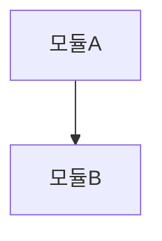

# {{번호}}. {{작업명}} — Design

- **날짜**: {{YYYY-MM-DD}}
- **Plan 참조**: `docs/artifacts/ideation/{{번호}}.{{작업명}}.md`
- **작성자**: {{에이전트 또는 사용자}}

---

## Executive Summary

| 항목 | 내용 |
|------|------|
| **접근 방식** | (선택한 설계 방향 한 줄) |
| **핵심 변경** | (주요 파일/모듈) |
| **리스크** | (가장 큰 기술적 위험) |

---

## 1. 설계 결정

### 선택한 접근 방식
(설계 방향 설명)

### 검토한 대안

| 대안 | 장점 | 단점 | 탈락 사유 |
|------|------|------|----------|
| A | | | |
| B | | | |

## 2. 아키텍처

### 구조도



### 변경 파일 목록

| 파일 | 변경 유형 | 설명 |
|------|----------|------|
| `path/to/file` | 신규/수정/삭제 | (변경 내용) |

## 3. 인터페이스 설계

### API / 함수 시그니처
```
(주요 인터페이스 정의)
```

### 데이터 흐름
```
입력 → 처리 → 출력
```

## 4. 품질 기준

| 기준 | 목표값 |
|------|--------|
| 테스트 커버리지 | (%) |
| 성능 | (기준) |
| 호환성 | (대상) |

## 5. 구현 순서

1. (첫 번째로 구현할 것)
2. (두 번째)
3. (세 번째)

## 6. 리스크 및 완화

| 리스크 | 영향 | 완화 방안 |
|--------|------|----------|
| | High/Medium/Low | |

---

> 이 문서는 `.claude/templates/design.template.md` 기반으로 생성됨
